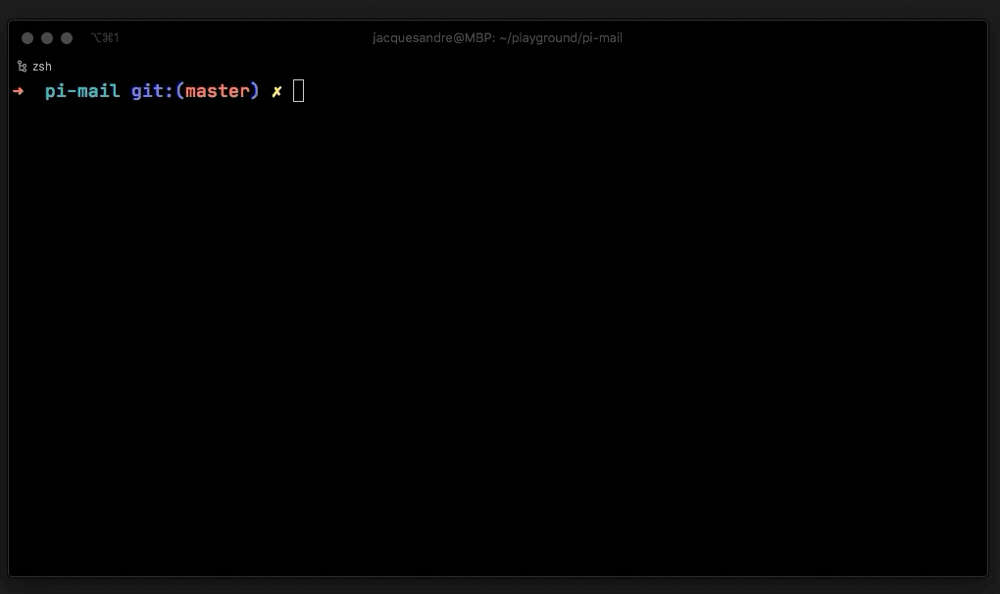
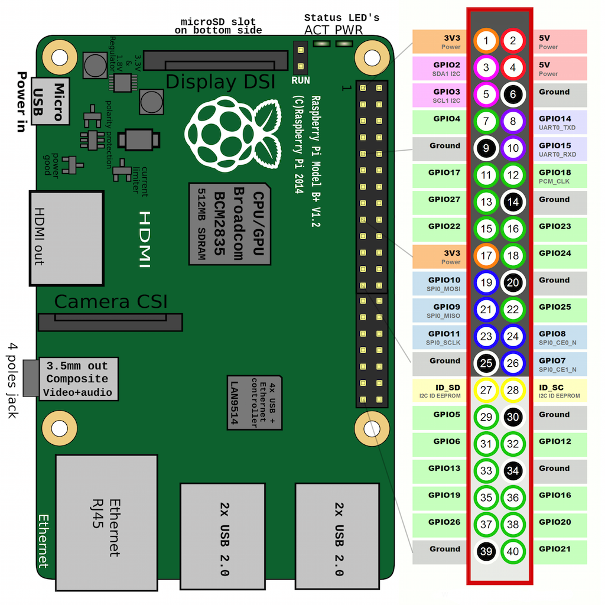
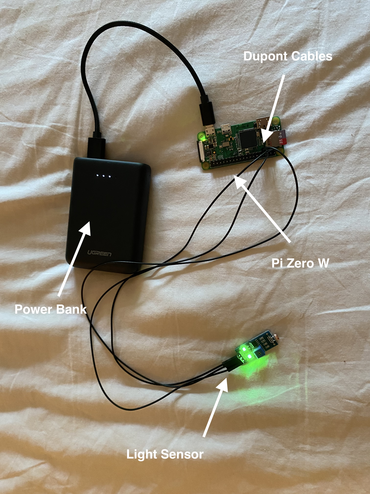
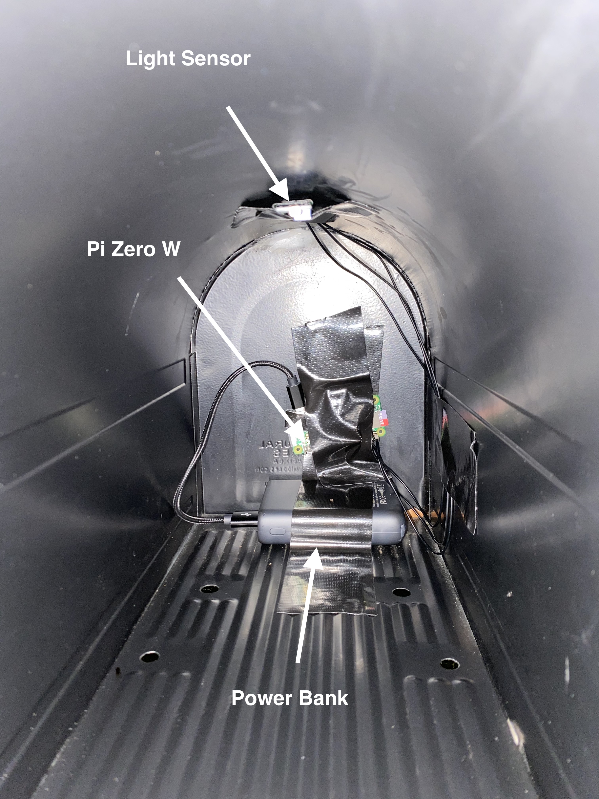

<p align="center">

</p>

# Pi Mail
- A python written mailbox notifier. 

## Intro:

For my final project I wanted to create something that is useful and would actually have a practical use in my life. I
had a raspberry pi lying around and finally decided to make something with it.

I first planned out the materials I would need for this project and how I would track if the mailbox was opened or not. A light sensor felt like the perfect opportunity for this as within the mailbox it is very dark and when opened light pours in. If positioned correctly the light sensor would be flooded with light as soon as someone opens it therefore triggering my sensor.  **My Plan:**

**Find the initial light scale of the mailbox and when it detects a change send me a notification that the box has been opened.**

### The Materials:

- [Light Sensor](https://www.amazon.com/gp/product/B00NLA4D4U/ref=ppx_yo_dt_b_asin_image_o03_s01?ie=UTF8&psc=1)
- [Raspberry Zero W With Headers](https://www.adafruit.com/product/3708)
- [Dupont Cables](https://www.amazon.com/gp/product/B07GCZV4BS/ref=ppx_yo_dt_b_asin_image_o03_s00?ie=UTF8&psc=1) (for connecting the pi to the light sensor)
- [SD Card](https://www.amazon.com/SanDisk-Ultra-UHS-I-Memory-Adapter/dp/B00M55C0NS/ref=sr_1_14?crid=364XEAJ80YZYX&dchild=1&keywords=sandisk+micro+sd+card&qid=1590181286&sprefix=sandisk+%2Caps%2C313&sr=8-14) (for [Raspbian Lite](https://www.raspberrypi.org/downloads/raspbian/))
- [Power Bank](https://www.amazon.com/Anker-PowerCore-Ultra-Compact-High-Speed-Technology/dp/B0194WDVHI/ref=sr_1_3?dchild=1&keywords=battery+bank&qid=1590175871&sr=8-3)

## The Setup:

I first began installing Raspbian on my pi and then used ssh to connect to my pi on my laptop.

<p align="center">
</img>
</p>


After I had began the initial setup of updating my pi I began researching the schematics for connecting the sensor to the pi, after looking around I found this diagram.

<p align="center">

<hr>

### Using this diagram I connected the light sensor to the pi using the dupont cables:
<br>

<p align="center">

</p>
<br>

## Programming:

I first began by testing to see whether my light sensor was working and wrote a simple python program to determine whether light was coming in or not.

I wrote this program while being SSHed into the pi using vim.

```python
import RPi.GPIO as GPIO
GPIO.setmode(GPIO.BCM)
GPIO.setup(4,GPIO.IN)

while(True):
    if(GPIO.input(4)):
        print("no light")
    else:
        print("light incoming")
```
[test.py](test.py)

This program prints "light incoming" if it saw light and "no light" if not. I needed to import `RPI.GPIO as GPIO`  to interact with the light sensor.


After having this basic concept down it wasn't too hard to follow up on my initial mailbox idea.

### Making the main script:

Understanding how the sensor works it was now just a matter of adding notifications and a few tweaks.

```python
import RPi.GPIO as GPIO
from pushover import init, Client
import time

# Pushover
init("<my key>")


GPIO.setmode(GPIO.BCM)
GPIO.setup(4,GPIO.IN)

while(True):
    if(not GPIO.input(4)):
        # on
        Client("<username key>").send_message("Mailbox has been opened", title="You've got mail!")
        time.sleep(120)
    else:
        # off
```
[mail.py](mail.py)

Using [pushover](https://pushover.net) I was able to trigger a notification to my phone every time light was detected. I used the [python-pushover](https://pypi.org/project/python-pushover/) library to make it easier to send requests.

I also made sure to add in a delay to the notifications to avoid [this](https://www.youtube.com/watch?v=zGl796352RI)

### My script should now:

detect the light > send a notification to my phone > wait 2 minutes before reactivation.

**This delay will prevent getting two notification from when the mailbox opens and 
closes.**

I also made sure to make the python script run on boot using crontab.


```linux
crontab -e
```

## Heres a demo:
### [Video Link](https://youtu.be/JY6uuFKJJAY)

</img>


As you can see Pushover is now working on my phone and alerts me every
time I have mail!

Now all is left to do is mount it in the mailbox

## Overall

This was a fun project and taught me a lot about both hardware and software components. I got to use python 
and linux to configure and program the pi while also using the pins on the board.

### Mounted to the mailbox

</img>

## Potential Improvements

Some improvements I could do:

- Maybe add a camera to the pi to take a photo of the mail
- Use Solar Power to power the pi rather than a battery bank that I have to change.
- Test other methods of detecting the mailbox opening (gyro sensor,camera,etc).


